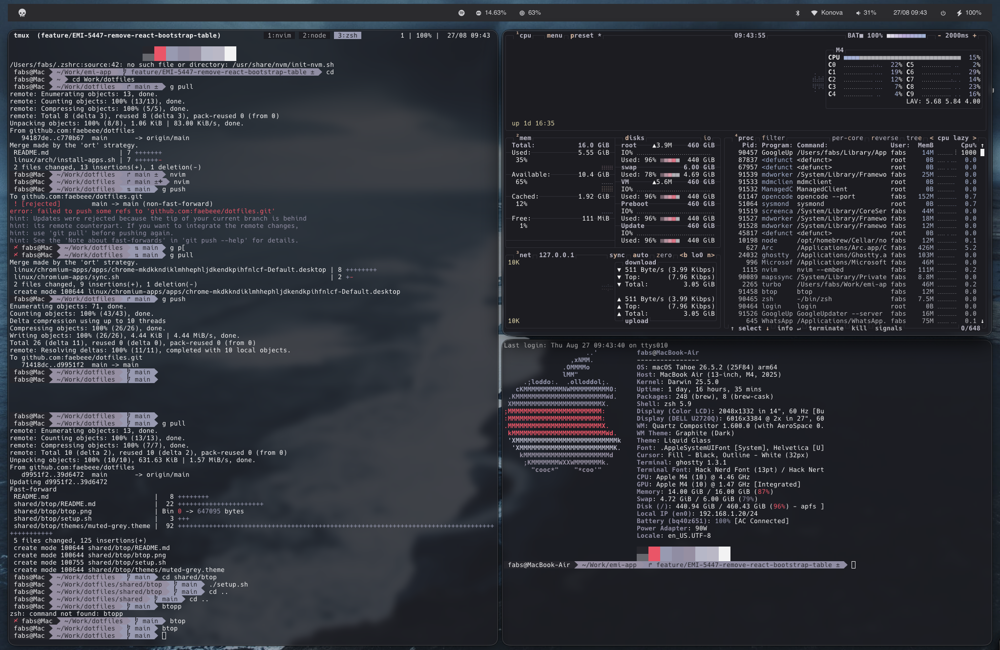
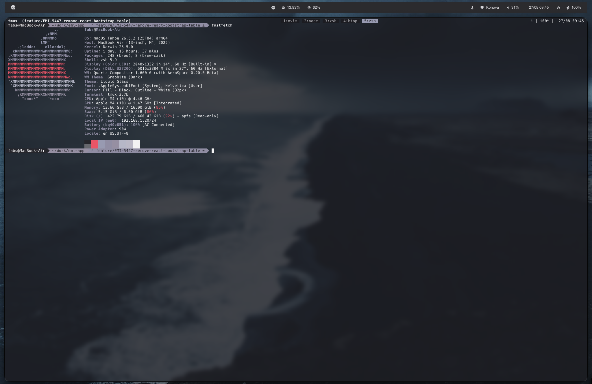
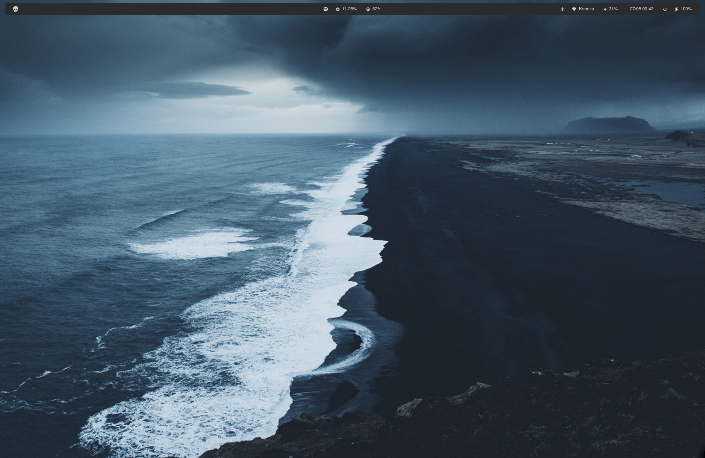
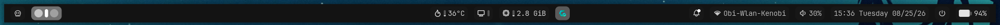
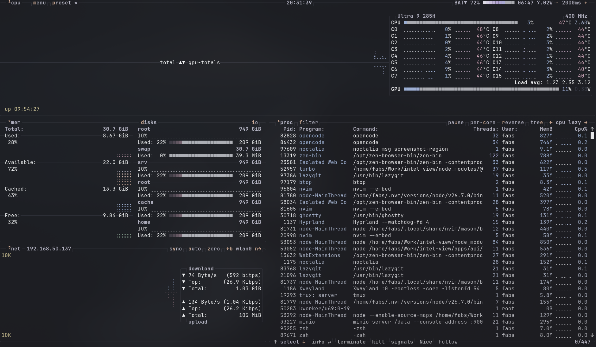
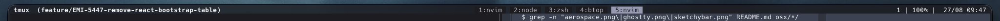

# dotfiles

Personal dotfiles. Each config lives in its own directory with a `setup.sh` (or similar) that symlinks/installs it into place — there's no central installer, so run the script inside each directory you want to apply.

## macOS

| Config | Description | Preview |
| --- | --- | --- |
| [`osx/aerospace`](./osx/aerospace) | Tiling window manager |  |
| [`osx/ghostty`](./osx/ghostty) | Terminal emulator |  |
| [`osx/sketchybar`](./osx/sketchybar) | Menu bar replacement |  |
| [`osx/apps`](./osx/apps) | Homebrew CLI tool bootstrap | - |

## Linux

| Config | Description | Preview |
| --- | --- | --- |
| [`linux/arch`](./linux/arch) | Arch Linux app bootstrap | - |
| [`linux/fedora`](./linux/fedora) | Fedora app bootstrap | - |
| [`linux/ghostty`](./linux/ghostty) | Terminal emulator (Linux variant) | - |
| [`linux/chromium-apps`](./linux/chromium-apps) | Chrome/Chromium web app launchers | - |
| [`linux/noctalia-hypr`](./linux/noctalia-hypr) | Hyprland WM + Noctalia shell |  |

## SketchyBar themes

- `osx/sketchybar/themes/` stores the available SketchyBar theme variants
- `osx/sketchybar/themes/mono.sh` is the default theme
- Set `THEME=<name>` before SketchyBar loads to switch themes, or add a new
  `themes/<name>.sh` file with the same variables to create a new look

## Shared

| Config | Description | Preview |
| --- | --- | --- |
| [`shared/btop`](./shared/btop) | btop theme setup |  |
| [`shared/nvim`](./shared/nvim) | Neovim (LazyVim-based) |  |
| [`shared/tmux`](./shared/tmux) | Terminal multiplexer |  |
| [`shared/zsh`](./shared/zsh) | Shell (oh-my-zsh) |  |
| [`shared/git`](./shared/git) | Global git config | - |
| [`shared/wallpapers`](./shared/wallpapers) | Wallpaper collection | - |

## btop themes

- `shared/btop/themes/` stores the available `btop` theme variants
- `shared/btop/themes/muted-grey.theme` is the current theme
- `shared/btop/btop.png` shows the theme in use
- Run `shared/btop/setup.sh` to symlink the themes into `~/.config/btop/themes`
