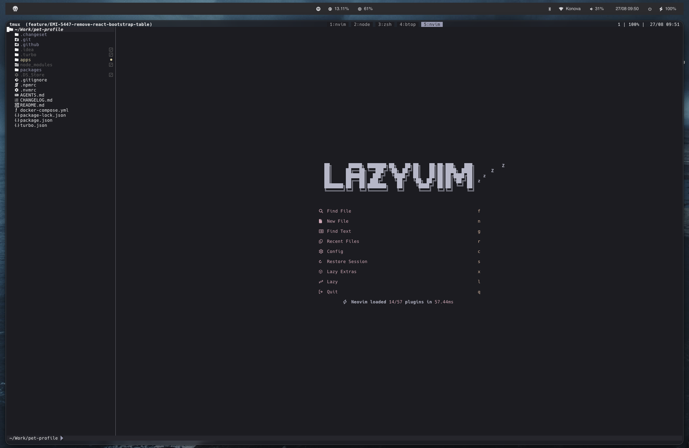

# 💤 LazyVim

A starter template for [LazyVim](https://github.com/LazyVim/LazyVim).
Refer to the [documentation](https://lazyvim.github.io/installation) to get started.

## Highlights

- LazyVim extras enabled: mini-comment, refactoring, JSON/Markdown/Tailwind/TypeScript (biome), ESLint, edgy UI (see `lazyvim.json`)
- Custom colorschemes: catppuccin, tokyonight, and custom `muted-grey` (dark) / `muted-white` (light) themes with a matching lualine theme
- Extra plugins: copilot, telescope, neo-tree, trouble, diffview, marks/bookmarks, CSS var highlighter/viewer, mdx, persistence, opencode integration, lsp-lens

## Setup

`setup.sh` symlinks this whole directory to `~/.config/nvim`.
